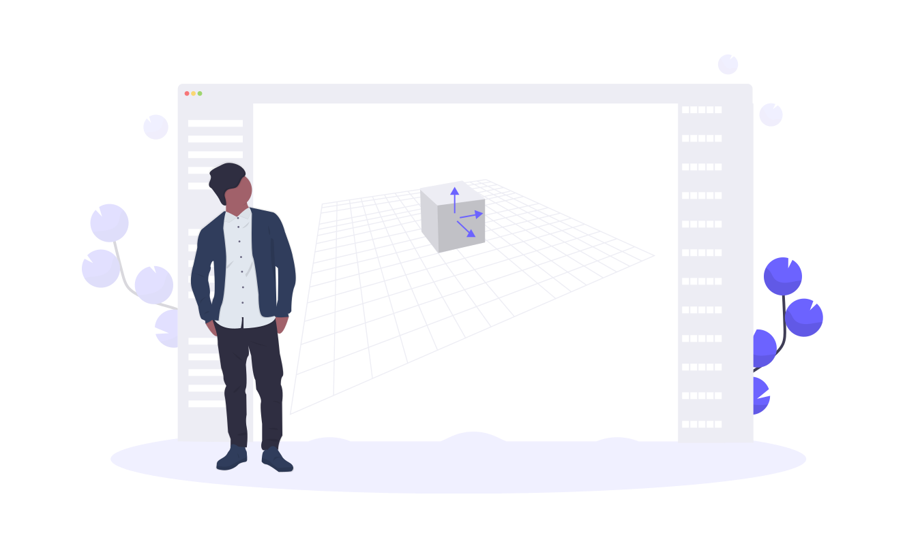

<h3 align="center">
  <a href="https://github.com/Rain120/vdom-diff-algorithm">Virtual Dom Diff Algorithm</a>
  
</h3>

<div align="center">

[](https://github.com/Rain120/vdom-diff-algorithm/watchers)
[](https://github.com/Rain120/vdom-diff-algorithm/stargazers) [](https://github.com/Rain120/vdom-diff-algorithm/network/members)

[](https://github.com/Rain120/vdom-diff-algorithm/issues) [](https://github.com/Rain120/vdom-diff-algorithm/pulls) [](https://github.com/Rain120/vdom-diff-algorithm/commits/master)


[](https://github.com/Rain120/vdom-diff-algorithm/blob/master/package.json) [](https://github.com/Rain120/vdom-diff-algorithm/blob/master/LICENSE)

</div>

## 😚 Welcome

Welcome to the **Virtual Dom Diff Algorithm**, The repo is a simple algorithm implementation for **virtual dom diff** for react or vue dom.

## 🎮 TL;DR

<!-- ⌨️ To be Continue... -->
[Demo](https://rain120.github.io/vdom-diff-algorithm/)

## ✍ Why am I doing this?

- Learn something about virtual dom diff from react or vue dom calculate way.

## 🔨 How to understand it?

### Through javaScript object description the Real DOM

**We had used the babel plugin which named @babel/plugin-transform-react-jsx transform for this step.**

#### Example

**React**

**In**

```jsx
const profile = (
  <div>
    
    <h3>{[user.firstName, user.lastName].join(' ')}</h3>
  </div>
);
```

**Out**
```jsx
const profile = React.createElement("div", null,
  React.createElement("img", { src: "avatar.png", className: "profile" }),
  React.createElement("h3", null, [user.firstName, user.lastName].join(" "))
);
```
More info go to [@babel/plugin-transform-react-jsx](https://babeljs.io/docs/en/babel-plugin-transform-react-jsx/)

or you can create a **class(ES6)** to descript the dom, just like this:

```js
class Element {
  type: string;
  props: Object<any>;
  children: Array<any>;

  constructor(type: stirng, props: Object<any>, children: Array<any>) {
    this.type = type;
    this.props = props;
    this.children = children;
  }
}
```

### Render to real dom

#### [createElement()](src/patch.js)

The javascript virtual dom renders to the HTML real dom.

```js
if (isString(node)) {
    return document.createTextNode(node + '');
  }
  const el = document.createElement(node.type);
  setProps(el, node.props || {});
  node.children &&
    node.children.map(createElement).forEach(el.appendChild.bind(el));

  return el;
```

### [Diff twice virtual dom](src/diff.js)

```js
function diff(oldNode, newNode) {
  if (!oldNode) {
    return { type: CREATE, newNode };
  }

  if (!newNode) {
    return { type: REMOVE };
  }

  if (changed(oldNode, newNode)) {
    return { type: REPLACE, newNode };
  }

  if (oldNode.type !== newNode.type) {
    return {
      type: UPDATE,
      props: diffProps(oldNode.props, newNode.props),
      children: diffChildren(oldNode.children, newNode.children)
    };
  }
}
```

### [Patch twice virtual dom](src/patch.js)

```js
function patch(parent, patches, index = 0) {
  if (!patches) {
    return;
  }
  const el = parent.children[index];

  switch (patches.type) {
    case CREATE: {
      const { newNode } = patches;
      const newEl = document.createElement(newNode);
      return parent.appendChild(newEl);
    }
    case REMOVE: {
      return parent.removeChild(el);
    }
    case REPLACE: {
      const { newNode } = patches;
      const newEl = createElement(newNode);
      return parent.replaceChild(newEl, el);
    }
    case UPDATE: {
      const { props, children } = patches;
      patchProps(el, props);
      children.forEach((child, idx) => {
        patch(el, child, idx);
      });
    }
  }
}
```

## 🤝 Contributing


We welcome all contributions. You can submit any ideas as [pull requests](https://github.com/Rain120/vdom-diff-algorithm/pulls) or as a GitHub [issue](https://github.com/Rain120/vdom-diff-algorithm/issues).

## 🔗 Links

- [virtual-dom](https://github.com/Matt-Esch/virtual-dom)

- [How to write your own Virtual DOM](https://medium.com/@deathmood/how-to-write-your-own-virtual-dom-ee74acc13060)

- [Under-the-hood-ReactJS](https://github.com/Bogdan-Lyashenko/Under-the-hood-ReactJS)

- [babel-plugin-transform-react-jsx](https://babeljs.io/docs/en/babel-plugin-transform-react-jsx/)

## 👨‍🏭 Author

> Front-End development engineer, technology stack: React + Typescript + Mobx, also used Vue + Vuex for a while

- [Github](https://github.com/Rain120)
- [知乎](https://www.zhihu.com/people/yan-yang-nian-hua-120/activities)
- [掘金](https://juejin.im/user/57c616496be3ff00584f54db)

## 📝 License

[MIT](https://github.com/Rain120/vdom-diff-algorithm/blob/master/LICENSE)

Copyright © 2020-present [Rain120](https://github.com/Rain120).

## ☕ Coffee or Tea


